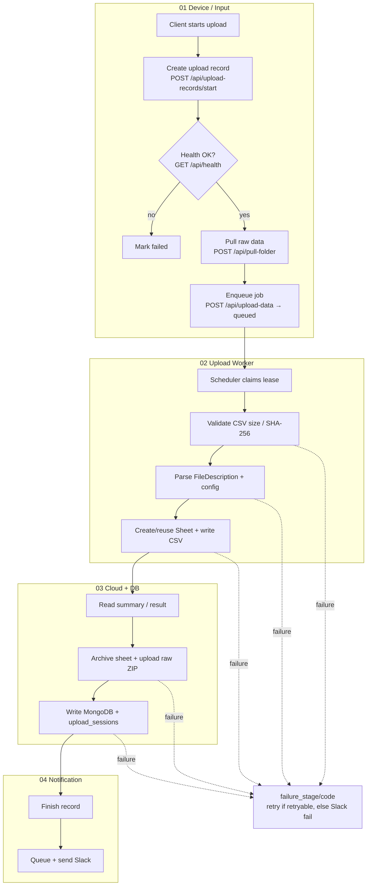

# Automated Data Upload Workflow

End-to-end flow from robot test data → Google Drive / Sheets → business DB → Slack.

Diagram: [`data-auto-upload-flowchart.png`](./data-auto-upload-flowchart.png) · Handler details: [`upload-flow.md`](../apps/backend/docs/upload-flow.md)

---

## Overview



---

## Stages

| Stage | Steps | Entry |
| --- | --- | --- |
| **01 Input** | Create record → health check → SFTP/SCP pull → enqueue | `data_center_client.upload_data_to_google_drive` |
| **02 Worker** | Claim lease → integrity check → parse → write Sheet | `UploadScheduler` → `run_queued_upload` |
| **03 Cloud+DB** | Summary → Drive archive/raw ZIP → business DB | `SpreadsheetUploadWorkflow` |
| **04 Notify** | Finish record → Slack (separate lease) | `finish_upload_record` / `notify_upload_result_to_slack` |

Manual upload (`POST /api/upload-data/manual`) joins the same worker after enqueue. Same SN + workflow uses `UploadWorkflowLock`.

---

## Call Chain

```text
upload_data_to_google_drive
  → start_upload_record → check_health → pull_folder → upload_data (enqueue)
       → UploadScheduler.claim → run_queued_upload
            → UploadData.update_data_to_google_drive
                 → SpreadsheetUploadWorkflow → Sheets/Drive + MongoDB → Slack
```

**States:** `queued` → `running`/`retrying` → `success`|`failed`  
**Retry:** lease + checkpoint + exponential backoff; Slack retries independently.

---

## Systems & Source

| System | Role |
| --- | --- |
| Robot / `data_center_client` | Produce CSV/raw folder; orchestrate client flow |
| Backend API | Health, pull, records, enqueue |
| `UploadScheduler` | Async upload + Slack workers |
| Google Sheets / Drive | Template, CSV, Unit Tracker, month archive, raw ZIP |
| MongoDB | `upload_records`, `upload_sessions`, business collections, messages |
| Slack | Success / failure notify |

| Path | Purpose |
| --- | --- |
| `apps/backend/scripts/data_center_client.py` | Client orchestration |
| `apps/backend/src/api/routers/uploads.py` | Upload APIs |
| `apps/backend/src/api/routers/file_transfer.py` | Pull folder |
| `apps/backend/src/modules/uploads/{upload,upload_records,scheduler}.py` | Worker, records, scheduler |
| `apps/backend/src/modules/uploads/handler/` | Parse, catalog, Spreadsheet workflow |
| `apps/web-ui/src/views/data/UploadRecordsView.vue` | Upload records UI |
