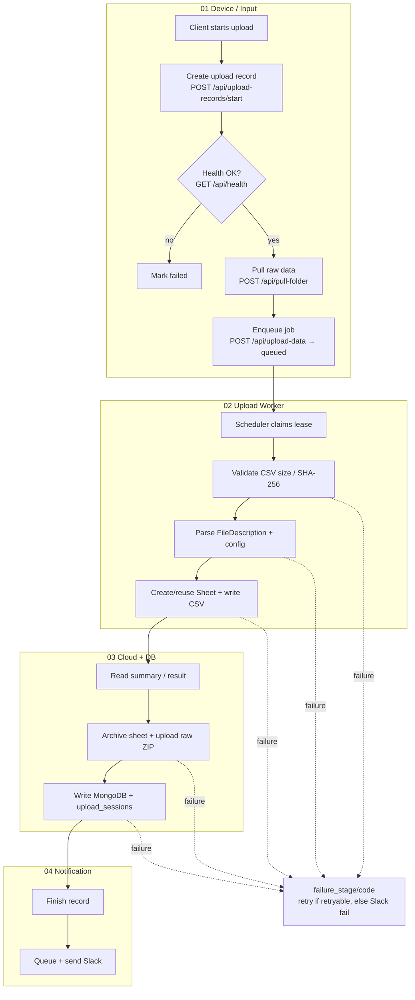

# Automated Data Upload Workflow

End-to-end flow from robot test data → Google Drive / Sheets → business DB → Slack.

Diagram: [`data-auto-upload-flowchart.png`](./data-auto-upload-flowchart.png) · Handler details: [`upload-flow.md`](../apps/backend/docs/upload-flow.md)

---

## Overview


```mermaid
flowchart TB
    subgraph S1["01 Device / Input"]
        A1["Client starts upload"]
        A2["Create upload record<br/>POST /api/upload-records/start"]
        A3{"Health OK?<br/>GET /api/health"}
        A4["Pull raw data<br/>POST /api/pull-folder"]
        A5["Enqueue job<br/>POST /api/upload-data → queued"]
        A1 --> A2 --> A3
        A3 -- no --> F1["Mark failed"]
        A3 -- yes --> A4 --> A5
    end

    subgraph S2["02 Upload Worker"]
        B1["Scheduler claims lease"]
        B2["Validate CSV size / SHA-256"]
        B3["Parse FileDescription + config"]
        B4["Create/reuse Sheet + write CSV"]
        A5 --> B1 --> B2 --> B3 --> B4
    end

    subgraph S3["03 Cloud + DB"]
        C1["Read summary / result"]
        C2["Archive sheet + upload raw ZIP"]
        C3["Write MongoDB + upload_sessions"]
        B4 --> C1 --> C2 --> C3
    end

    subgraph S4["04 Notification"]
        D1["Finish record"]
        D2["Queue + send Slack"]
        C3 --> D1 --> D2
    end

    B2 & B3 & B4 & C2 & C3 -.failure.-> E1["failure_stage/code<br/>retry if retryable, else Slack fail"]
```

---

## Stages

| Stage | Steps | Entry |
| --- | --- | --- |
| **01 Input** | Create record → health check → SFTP/SCP pull → enqueue | `data_center_client.upload_data_to_google_drive` |
| **02 Worker** | Claim lease → integrity check → parse → write Sheet | `UploadScheduler` → `run_queued_upload` |
| **03 Cloud+DB** | Summary → Drive archive/raw ZIP → business DB | `SpreadsheetUploadWorkflow` |
| **04 Notify** | Finish record → Slack (separate lease) | `finish_upload_record` / `notify_upload_result_to_slack` |

Manual upload (`POST /api/upload-data/manual`) joins the same worker after enqueue. Same SN + workflow uses `UploadWorkflowLock`.

### Robot parallelism / Leveling

Leveling uploads first paste the entire source CSV into the template-derived spreadsheet's `Leveling` tab starting at `A1`. The width comes from the widest source row, independently of the configured CSV range. All source rows, headers, metadata, timestamps and serial numbers are retained; the destination grid expands when necessary. The separate master-sheet rows retain the Robot serial number and exclude `START_TIME` and `RESULT_STATUS`.

In **数据上传设置**, set **平行度测试总表链接 ID** to the spreadsheet ID (a full Google Sheets URL is also accepted) and save. This setting is shared across OEMs within the selected production/engineering environment and is required for Robot Leveling uploads.

**手动上传数据 → Robot平行度** accepts a Leveling report CSV, such as `csv-samples/FLXA3020250805002-leveling-report-2026-07-22.csv`. Robot and standard uploads of the same report use the same processing step. The four named `TEST` sections are validated before uploading; each master row contains `ROBOT_SN` followed by measurements in their CSV order. Only trailing empty padding is ignored for extraction; the raw template data remains complete.

| CSV test section | Master-sheet tab | Columns |
| --- | --- | --- |
| `z_leveling_test` | `Z Stage Parallelism` | `C:AP` |
| `ch8_leveling_test` | `Pipette To Deck Parallelism` | `B:N` |
| `ch96_leveling_test` | `Pipette To Deck Parallelism` | `P:BB` |
| `gripper_leveling_test` | `Gripper Parallelism` | `B:K` |

Parallelism uses the same system `last_row` setting and first-empty-row search as Unit Tracker. Starting at row 11, it checks the configured columns together with the actual destination columns; formulas count as occupied and gaps may be filled. With the default `F:I`, the effective checks are Z `C:AP`, CH8 `B:N`, CH96 `F:BB`, and Gripper `B:K`. Multiple measurement rows require a consecutive empty block. The four destinations are located separately, so CH8 and CH96 may use different rows. The step runs before the database write and does not wait for the other Robot tests in the combined workflow. Missing sections, invalid data, missing configuration, or Sheets errors fail the upload. Checkpoints retain the target ranges for retries; completed writes are skipped, and conflicting cells stop the retry rather than being overwritten.

Production uses spreadsheet `1fXdzjJYb9-pNW4fdvOKS4wZpoTXgIKCzFUTheVr4XeA`. Its actual pipette tab is named `Pipette To Deck Parallelism` (one `p` after `Pi`). Engineering configuration remains separate. Its CH8 and Z slot order differs from the sample CSV; measurement reordering needs to be agreed before relying on those header labels. Gripper X also labels the pair Front/Rear while the CSV calls it Left/Right.

### Flex combined uploads

The five CSVs in `csv-samples/opentrons/Flex` share Robot barcode `FLXU3020260601004`. Z-Stage parsing prefers `test_robot_id`, then falls back to `test_tag` / `test_device_id`; manual barcode overrides also update `test_robot_id`.

All five Robot test types now use `robot_diagnostic` for their combined business record, so completion flags can merge regardless of upload order. Historical per-test collections are retained without migration; a fresh complete upload of the five reports exercises the corrected workflow. The template is reused across the five tests. Parallelism rows are written when Leveling arrives; Unit Tracker is written after all five tests have been saved.

All CSV template uploads expand the destination grid before writing, including the 11,450-row Gantry-Stress sample. Unit Tracker checks the configured empty-row range together with the actual paste columns (Robot: `F:AI` for a `J:AI` write), starts at row 11, treats formulas as occupied, and propagates read failures. Row selection and paste are serialized within the worker process; independent processes or external editors are not covered by that lock.

---

## Call Chain

```text
upload_data_to_google_drive
  → start_upload_record → check_health → pull_folder → upload_data (enqueue)
       → UploadScheduler.claim → run_queued_upload
            → UploadData.update_data_to_google_drive
                 → SpreadsheetUploadWorkflow → Sheets/Drive + MongoDB → Slack
```

**States:** `queued` → `running`/`retrying` → `success`|`failed`  
**Retry:** lease + checkpoint + exponential backoff; Slack retries independently.

---

## Systems & Source

| System | Role |
| --- | --- |
| Robot / `data_center_client` | Produce CSV/raw folder; orchestrate client flow |
| Backend API | Health, pull, records, enqueue |
| `UploadScheduler` | Async upload + Slack workers |
| Google Sheets / Drive | Template, CSV, Unit Tracker, month archive, raw ZIP |
| MongoDB | `upload_records`, `upload_sessions`, business collections, messages |
| Slack | Success / failure notify |

| Path | Purpose |
| --- | --- |
| `apps/backend/scripts/data_center_client.py` | Client orchestration |
| `apps/backend/src/api/routers/uploads.py` | Upload APIs |
| `apps/backend/src/api/routers/file_transfer.py` | Pull folder |
| `apps/backend/src/modules/uploads/{upload,upload_records,scheduler}.py` | Worker, records, scheduler |
| `apps/backend/src/modules/uploads/handler/` | Parse, catalog, Spreadsheet workflow |
| `apps/web-ui/src/views/data/UploadRecordsView.vue` | Upload records UI |
