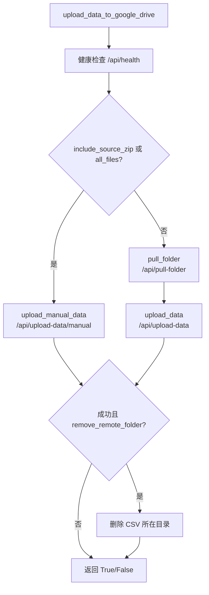

# data_center_client_new 使用指南

`data_center_client_new.py` 是一个可独立使用的 Data Center 上传客户端。它通过 HTTP 调用后端 API，把本地 CSV 测试数据提交到 Google Drive / Google Sheet。

与旧版 `data_center_client.py` 相比，新版默认走**手动上传 API**（`/api/upload-data/manual`），并支持「只附带 CSV 源文件」和「打包整个目录」两种原数据上传方式。

## 特点

- **单文件独立运行**：不依赖本项目其他模块，只需安装 `requests`
- **可命令行使用，也可 import 调用**
- **自动发现服务器**：先连默认地址，失败则扫描局域网
- **兼容机器人拉取流程**：不传源文件参数时，仍可走旧的 pull + upload 流程

## 环境要求

- Python 3.8+
- `requests`

```bash
pip install requests
```

将 `data_center_client_new.py` 复制到任意目录即可使用，无需整个 `data-handler` 项目。

## 默认服务器地址

文件顶部定义了常量，可按需直接修改：

```python
DEFAULT_SERVER_HOST = "192.168.0.137"
DEFAULT_SERVER_PORT = 8090
DEFAULT_BASE_URL = f"http://{DEFAULT_SERVER_HOST}:{DEFAULT_SERVER_PORT}"
```

连接顺序：

1. 访问 `DEFAULT_BASE_URL` 的 `/api/health`
2. 失败则扫描本机网关所在网段 `x.x.x.0/24`
3. 仍失败则退回默认 URL

## 命令行用法

### 基本语法

```bash
python data_center_client_new.py --csv <本地CSV路径> [选项]
```

### 常用示例

**只上传 CSV 数据（不附带原文件 zip）**

```bash
python data_center_client_new.py --csv /path/to/test.csv
```

**附带 CSV 本身作为源文件**

```bash
python data_center_client_new.py --csv /path/to/test.csv --include-source-zip
```

**打包 CSV 所在目录的全部文件作为源文件**

```bash
python data_center_client_new.py --csv /path/to/test.csv --all-files
```

客户端会把同目录下除 CSV 以外的文件作为 `source_files` 一并上传；服务端再按目录规则打包成 zip。

**指定服务器地址**

```bash
python data_center_client_new.py \
  --csv /path/to/test.csv \
  --base-url http://192.168.1.100:8090
```

**从机器人拉取文件夹后上传（旧流程）**

```bash
python data_center_client_new.py \
  --csv /path/to/test.csv \
  --pull-folder \
  --pull-method scp
```

上传成功后删除本地 CSV 所在目录：

```bash
python data_center_client_new.py \
  --csv /path/to/test.csv \
  --pull-folder \
  --delete-folder
```

### 命令行参数一览

| 参数 | 说明 |
|------|------|
| `--csv` | 本地 CSV 文件路径（必填） |
| `--base-url` | Data Center 服务地址，默认自动检测 |
| `--timeout` | HTTP 超时秒数，默认 `120` |
| `--include-source-zip` | 将 CSV 本身打包为源文件 zip |
| `--all-files` | 打包 CSV 所在目录全部文件为源文件 zip |
| `--pull-folder` | 先走机器人拉取流程，再上传 |
| `--pull-method` | 拉取方式：`scp`（默认）或 `sftp` |
| `--delete-folder` | 上传成功后删除 CSV 所在本地目录 |
| `--skip-health` | 跳过上传前的健康检查（仅非 `--pull-folder` 模式） |

## Python 调用

### 配置服务器

```python
from data_center_client_new import configure_client

configure_client(base_url="http://192.168.0.137:8090", timeout=120)
```

`configure_client` 会设置模块级全局变量，适合在程序启动时调用一次。

### 推荐入口：`upload_data_to_google_drive`

完整流程封装，内部包含健康检查和分支选择。

```python
from data_center_client_new import configure_client, upload_data_to_google_drive

configure_client(base_url="http://192.168.0.137:8090")

ok = upload_data_to_google_drive(
    csv_file_path="/path/to/test.csv",
    include_source_zip=False,
    all_files=False,
)

if ok:
    print("上传成功")
else:
    print("上传失败")
```

**参数说明**

| 参数 | 类型 | 默认值 | 说明 |
|------|------|--------|------|
| `csv_file_path` | `str` | 必填 | 本地 CSV 路径 |
| `remove_remote_folder` | `bool` | `False` | 成功后删除 CSV 所在目录 |
| `pull_method` | `str` | `"scp"` | 机器人拉取方式 |
| `include_source_zip` | `bool` | `False` | 是否附带源文件（仅 CSV） |
| `all_files` | `bool` | `False` | 是否打包同目录全部文件 |

兼容旧参数名：`delete_folder=True` 等价于 `remove_remote_folder=True`。

**返回值**：`bool`，`True` 表示成功，`False` 表示失败。

### 底层 API：`upload_manual_data`

直接调用手动上传接口，返回完整 JSON 响应。

```python
from data_center_client_new import configure_client, upload_manual_data

configure_client(base_url="http://192.168.0.137:8090")

response = upload_manual_data(
    csv_file_path="/path/to/test.csv",
    include_source_zip=True,
    all_files=True,
)

print(response)
# {
#   "success": true,
#   "record_id": "...",
#   "csv_file": "/data/temp/manual_uploads/.../test.csv",
#   "zip_file": "/data/temp/.../test-name-20260608_120000.zip",
#   "message": "Upload task submitted"
# }
```

适合需要拿到 `record_id`、在 Web UI 里跟踪上传进度的场景。

### 其他可用函数

| 函数 | 用途 |
|------|------|
| `check_health()` | 检查 Slack / Google Drive 连通性 |
| `get_base_url()` | 获取当前使用的服务地址 |
| `upload_data(csv_path, zip_path)` | 调用 `/api/upload-data`（服务端路径） |
| `pull_folder(csv_path, folder_name)` | 从机器人拉取文件夹 |

## 上传模式说明

### `include_source_zip` 与 `all_files`

两个参数控制不同的行为层级：

| `include_source_zip` | `all_files` | 行为 |
|---------------------|-------------|------|
| `False` | `False` | 机器人拉取 → `/api/upload-data` |
| `True` | `False` | 手动上传，仅将 CSV 打成 zip，无大小限制 |
| `True` | `True` | 手动上传，打包目录全部文件 |
| `False` | `True` | 手动上传，打包目录全部文件（自动开启源文件） |

目录打包时，服务端限制：

- 最多 10 个文件
- 打包时间不超过 10 秒
- zip 不超过 10MB

仅打包 CSV 本身时没有上述限制。

### 流程图



## 调用的后端 API

| 端点 | 用途 |
|------|------|
| `GET /api/health` | 健康检查 |
| `POST /api/upload-data/manual` | 手动上传（新版默认） |
| `POST /api/pull-folder` | 从机器人拉取测试文件夹 |
| `POST /api/upload-data` | 使用服务端已有路径上传 |

手动上传 API 表单字段：

| 字段 | 说明 |
|------|------|
| `csv_file` | CSV 文件（multipart） |
| `include_source_zip` | 是否附带源文件 zip |
| `all_files` | 是否打包目录全部文件 |
| `source_files` | 同目录其他文件（`--all-files` 时由客户端自动附带） |

## 与 Web 手动上传的对应关系

Web 上传页（上传记录 → 手动上传）与客户端参数一致：

| Web 勾选项 | 客户端参数 |
|-----------|-----------|
| 上传源文件 | `include_source_zip=True` |
| 上传文件夹 | `all_files=True` |

Web 上只有勾选「上传文件夹」时才会出现 10MB 警告；仅勾选「上传源文件」时只打包 CSV，无警告。

## 常见问题

### 连接不上服务器

1. 确认 Data Center 后端已启动（默认端口 `8090`）
2. 用 `--base-url` 显式指定地址
3. 或在代码里先调用 `configure_client(base_url="...")`

### 健康检查失败

`upload_data_to_google_drive` 会在上传前检查 Slack 和 Google Drive 状态。若 `status` 不为 `true`，直接返回 `False`。

可单独排查：

```python
from data_center_client_new import check_health
print(check_health())
```

### `--all-files` 上传失败

常见原因：

- 目录文件数超过 10 个
- 打包后 zip 超过 10MB
- 打包耗时超过 10 秒

可先用 `--include-source-zip` 只上传 CSV 验证链路是否正常。

### import 后拿不到 `record_id`

`upload_data_to_google_drive` 只返回 `bool`。需要 `record_id` 时请直接调用 `upload_manual_data`。

### 日志输出到 stdout

函数内部使用 `print` 输出步骤信息。嵌入其他程序时如需静默，可自行重定向 stdout，或直接调用 `upload_manual_data` 等底层函数。

## 与旧版 client 的选择

| 场景 | 推荐 |
|------|------|
| 本地 CSV + 手动上传 API | `data_center_client_new.py` |
| 机器人自动拉取 + 服务端路径上传 | 两者均可；新版 `--pull-folder` 仍支持 |
| 只需传服务端已有 csv/zip 路径 | `data_center_client.py` 的 `upload_data()` |

## 文件位置

```
backend/data_center_client_new.py
backend/docs/data-center-client-new.md   # 本文档
```
