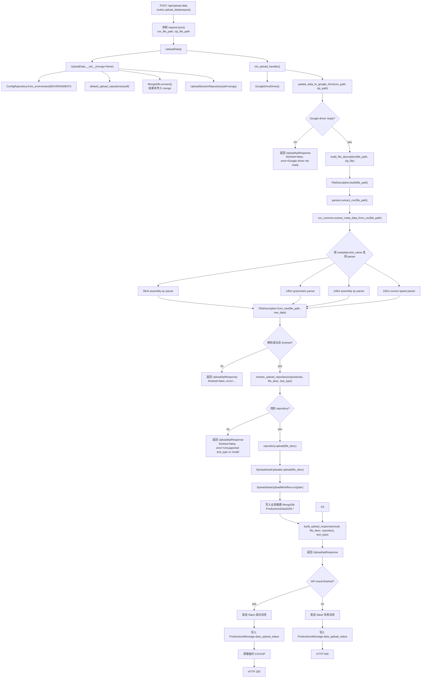
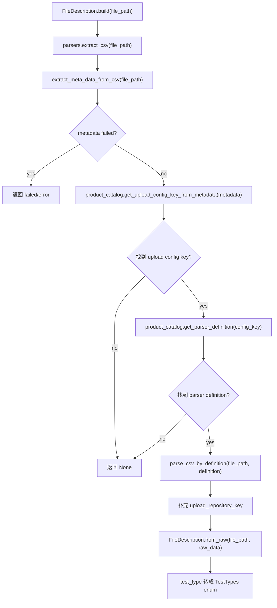
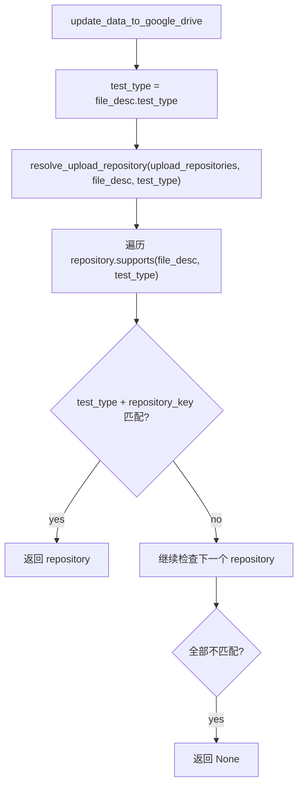
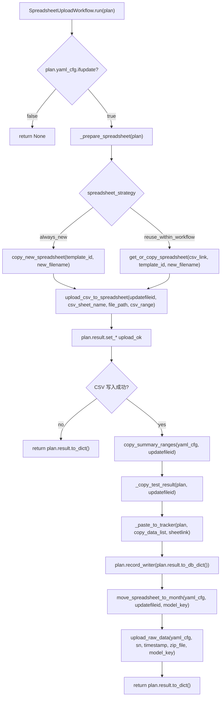

# Upload Handler 运行链路

本文档描述当前 `upload_handler` 从拿到 CSV 文件路径，到上传 Google Drive / Google Sheet，再到写入 MongoDB 的完整流程。

核心入口有两个层级：

- API 入口：`backend/src/api/routes.py::upload_data(request)`
- 业务入口：`backend/src/upload_handler/upload.py::UploadData.update_data_to_google_drive(file_path, zip_file=None)`

## 总览流程图



## 文件路径来源

### 1. 外部调用直接传路径

`routes.upload_data(request)` 从 JSON body 读取：

| 参数 | 来源 | 传给业务层的参数 |
| --- | --- | --- |
| `csv_file_path` | `body.get("csv_file_path")` | `file_path` |
| `zip_file_path` | `body.get("zip_file_path")` | `zip_file` |

调用位置：

```python
upload_handler = UploadData()
upload_handler.init_upload_handler()
result = upload_handler.update_data_to_google_drive(csv_path, zip_path)
```
    
### 2. 前置接口生成路径

`routes.pull_folder(request, csv_file, folder_name, pull_method="sftp")` 会：

1. 将上传的 CSV 保存到 `settings.DOWNLOAD_DIR`。
2. 使用 SFTP/SCP 从 robot 拉取原始数据文件夹。
3. 调用 `zip_folder(final_folder_path)` 压缩原始数据。
4. 返回 `file_name` 和 `zip_path`，供 `/upload-data` 再次调用。

这一步只负责准备本地路径，不执行核心上传。

## 核心对象初始化

### `UploadData.__init__(mongo: MongoDB = None) -> None`

文件：`backend/src/upload_handler/upload.py`

职责：

- 初始化日志。
- 创建 `CsvDriver`。
- 根据 `settings.ENVIRONMENT` 读取 upload YAML 配置。
- 注册所有 upload repository。
- 连接 MongoDB。
- 创建 `UploadSessionRepository`，用于跨测试复用同一个 sheet。

关键字段：

| 字段 | 来源 | 说明 |
| --- | --- | --- |
| `self.gdrive` | 初始为 `None` | 后续由 `init_upload_handler()` 创建 |
| `self.csv_driver` | `CsvDriver()` | 读取 CSV 行数据 |
| `self.config_repo` | `ConfigRepository.from_environment(ENVIRONMENT)` | 读取 `upload_debug.yaml` 或 `upload_production.yaml` |
| `self.upload_repositories` | `default_upload_repositories(self)` | 当前支持的产品/测试上传策略 |
| `self.mongo` | 传入参数或 `MongoDB()` | MongoDB 客户端包装 |
| `self.upload_session_repo` | `UploadSessionRepository(self.mongo)` | 跨测试 workflow 状态记录 |
| `self.nowmonth` | `get_current_month()` | 按月份选择 Google Drive 文件夹 |

### `init_upload_handler() -> None`

文件：`backend/src/upload_handler/upload.py`

职责：

- 创建 `GoogleDriveDriver()`。
- 失败时写 error log，并打印初始化失败原因。

这个方法必须在 `update_data_to_google_drive()` 前执行，否则会返回 `Google driver not ready`。

## CSV 解析流程

### 流程图



### `FileDescription.build(file_path: str)`

文件：`backend/src/upload_handler/models/domain.py`

参数：

| 参数 | 类型 | 说明 |
| --- | --- | --- |
| `file_path` | `str` | 本地 CSV 文件路径 |

返回：

- 成功：`FileDescription`
- 失败：`None`

内部调用：

- `extract_csv(file_path)`
- `FileDescription.from_raw(file_path=file_path, raw_data=raw_data)`

### `extract_csv(file_path: str) -> Optional[dict]`

文件：`backend/src/upload_handler/parsers/registry.py`

职责：

- 先用 `extract_meta_data_from_csv(file_path)` 读取 metadata。
- 调用 `product_catalog.get_upload_config_key_from_metadata(metadata)`，根据 SN 推导 `model`，根据 `test_name` 推导 `test_type`，最后得到 YAML upload config key。
- 用 upload config key 从 `product_catalog.get_parser_definition(config_key)` 获取 parser definition。
- 调用 `parse_csv_by_definition(file_path, definition)` 生成统一 `file_desc` 原始 dict。

当前 parser definition key：

| upload config key | parser definition |
| --- | --- |
| `1ch_update_volume` | 1ch Gravimetric |
| `8ch_update_volume` | 8ch Gravimetric |
| `1ch_update_assembly_qc` | 1ch Assembly QC |
| `8ch_update_assembly_qc` | 8ch Assembly QC |
| `1ch_update_current_speed` | 1ch Current Speed |
| `8ch_update_current_speed` | 8ch Current Speed |
| `96_p200_update_qc` | 96ch P200 Assembly QC |
| `96_p1000_update_qc` | 96ch P1000 Assembly QC |
| `8ch_update_burn_in_result` | 8ch Burn-in result |
| `8ch_update_burn_in_records` | 8ch Burn-in recorder |

### Parser Definition

文件：`backend/src/upload_handler/parsers/definitions.py`

每个 YAML upload config key 都对应一个 `CsvParserDefinition`，用于描述 CSV 的结构：

| 字段 | 说明 |
| --- | --- |
| `metadata_range` | metadata 起止标记 |
| `finish_range` | 完成度判断起止标记、匹配规则和危险值 |
| `sn` | 从哪个 key 读取设备序列号，以及需要移除的 suffix |
| `kind` | 从哪个 key 读取生产阶段/OEM 信息 |
| `test_name` | 从哪个 key 读取测试名 |
| `config_range` | 需要从 config 区间读取字段时配置，如 Gravimetric 的 `kind` |

`finish_range` 用来判断报告是否跑完，不判断测试是否通过。默认规则是：

- 先按 `start` / `end` 找结果区间。
- 再用 `key_contains_all`、`key_contains_any` 过滤需要检查的行。
- 命中 `ignore_keys` 的行直接跳过。
- 默认 `mode="all_present"`：匹配行的 value 不能是 `None` 或空字符串。
- `FAIL` 不代表报告未完成，只代表测试结果失败。

### `extract_meta_data_from_csv(file_path: str) -> dict`

文件：`backend/src/upload_handler/parsers/csv_common.py`

职责：

- 固定按 B 列读取 key、C 列读取 value。
- 优先在 metadata 起止标记之间提取字段。
- 如果 metadata 区间找不到，则只扫描 CSV 前 10 行作为兜底。
- `test_name` key 做格式兼容，`test-name`、`test_name`、`test name` 等都会规范化写入 `metadata["test_name"]`。
- 文件不存在时返回 `{"error": "文件未找到: ...", "failed": True}`。

### 产品 parser 输出字段

各产品 parser 最终都要返回可以构建 `FileDescription` 的 dict：

| 字段 | 说明 |
| --- | --- |
| `metadata` | CSV metadata 原始信息 |
| `finished` | 该 CSV 报告是否完整运行完成，不代表测试是否 PASS |
| `file_name` | CSV 文件名 |
| `sn` | 设备序列号 |
| `model` | 产品型号，如 `P1000M` |
| `kind_stage_type` | 生产阶段类型，如 `Production` |
| `kind_oem_type` | OEM 类型，如 `Opentrons`、`Ultima`、`Millipore` |
| `test_type` | 测试类型，后续转成 `TestTypes` enum |
| `error` | `"False"` 表示解析无错误，否则是错误描述 |

### 产品/测试类型统一入口

文件：`backend/src/upload_handler/product_catalog.py`

| 方法 | 参数 | 返回 | 说明 |
| --- | --- | --- | --- |
| `get_model_from_serial_number(sn)` | `sn: str` | `str` | 通过条码前缀识别型号 |
| `get_test_type_from_name(test_name)` | `test_name: str` | `str` | 通过 test name 识别测试类型 |
| `get_oem_type_from_text(text)` | `text: str | None` | `str` | 通过正则匹配 OEM 厂商类型，未命中默认 `Opentrons` 并打印 warning |
| `normalize_test_type(test_type)` | `str | TestTypes | None` | `TestTypes | None` | 将 enum、enum value 或原始 test name 统一成 `TestTypes` |
| `get_upload_config_key(model, test_type)` | `model: str`, `test_type: str | TestTypes | None` | `str` | 根据产品型号和测试类型返回 YAML 配置 key，如 `1ch_update_volume` |
| `get_upload_config_combine(config_key)` | `config_key: str` | `tuple[str, ...]` | 读取 `UPLOAD_CONFIG_COMBINES`，返回当前配置 key 所属的跨测试组合 |
| `get_upload_workflow_from_config_key(config_key)` | `config_key: str` | `str` | 根据组合生成稳定 workflow 名 |
| `get_upload_workflow(model, test_type)` | `model: str`, `test_type: str | TestTypes | None` | `str` | 根据产品和测试解析配置 key，再生成 upload session workflow |
| `get_upload_product_profile(model)` | `model: str` | `UploadProductProfile | None` | 读取产品上传 profile |
| `get_upload_uploader_key(model)` | `model: str` | `str | None` | 返回 uploader 选择 key；当前统一为 `spreadsheet` |
| `get_upload_collection_name(model, workflow="assembly_qc")` | `model: str`, `workflow: str` | `str` | 根据产品 profile 拼接 MongoDB 业务集合名 |

跨测试绑定关系集中放在 `UPLOAD_CONFIG_COMBINES`：

```python
UPLOAD_CONFIG_COMBINES = [
    ("1ch_update_assembly_qc", "1ch_update_current_speed"),
    ("8ch_update_assembly_qc", "8ch_update_current_speed"),
]
```

同一组里的配置 key 会生成同一个 workflow。比如 `1ch_update_assembly_qc` 和 `1ch_update_current_speed` 都会得到 `1ch_update_assembly_qc__1ch_update_current_speed`，因此这两个测试会互相查找同一台机器未补齐的 upload session，并复用同一个 Google Sheet。

## Repository 选择流程

### 流程图



### `default_upload_repositories(context) -> list[UploadRepository]`

文件：`backend/src/upload_handler/repositories/upload_repository.py`

当前只注册一个通用 uploader：

| Repository | Uploader | 支持条件 |
| --- | --- | --- |
| `UploadRepository` | `SpreadsheetUploader` | `UPLOAD_HANDLER_CONFIGS` 存在当前 `upload_config_key` |

### `resolve_upload_repository(upload_repositories, file_desc, test_type=None)`

文件：`backend/src/upload_handler/repositories/upload_repository.py`

参数：

| 参数 | 类型 | 说明 |
| --- | --- | --- |
| `upload_repositories` | `list[UploadRepository]` | 已注册的仓储策略 |
| `file_desc` | `dict` / `FileDescription` | 解析后的文件描述 |
| `test_type` | `Optional[TestTypes]` | 测试类型；未传时尝试从 `file_desc.test_type` 读取 |

返回：

- 匹配成功：对应 `UploadRepository`
- 匹配失败：`None`

## 通用上传入口

### `SpreadsheetUploader.upload(file_desc)`

文件：`backend/src/upload_handler/uploaders/spreadsheet_uploader.py`

所有产品/测试现在都走同一个 upload 方法。差异来自：

| 配置来源 | 负责内容 |
| --- | --- |
| `UPLOAD_HANDLER_CONFIGS` | 展示名、文件名模板、时间格式、tracker 默认 tab、sheet link 写入方式 |
| `UPLOAD_DATABASE_CONFIGS` | DB workflow、测试字段、上传状态字段 |
| `UPLOAD_CONFIG_COMBINES` | 多测试是否合并到同一条记录和同一个 Unit Tracker append |
| YAML | 模板 ID、CSV 写入 tab/range、result cell、summary copy range、Unit Tracker 目标、月份文件夹 |

核心步骤：

1. 读取 `file_desc.upload_config_key`。
2. 从 `UPLOAD_HANDLER_CONFIGS` 读取通用上传参数。
3. 从 YAML 读取模板、CSV 目标、result cell 和 tracker 配置。
4. 调用 `query_reusable_csv_link(...)` 查找组合测试中可复用的 sheet。
5. 创建 `SpreadsheetUploadPlan`。
6. 交给 `SpreadsheetUploadWorkflow.run(plan)` 执行通用流程。

## 通用 Spreadsheet workflow

### 流程图



### `SpreadsheetUploadPlan`

文件：`backend/src/upload_handler/uploaders/workflows.py`

核心字段：

| 字段 | 类型 | 说明 |
| --- | --- | --- |
| `yaml_cfg` | `dict` | 当前测试配置 |
| `result` | `UploadResult` | 上传结果构建器 |
| `file_desc` | `dict` | 文件描述 |
| `template_id` | `str` | Google Sheet 模板 ID |
| `new_filename` | `str` | 复制模板后的新文件名 |
| `timestamp` | `str` | 当前上传时间戳 |
| `spreadsheet_strategy` | `str` | `always_new` 或 `reuse_within_workflow` |
| `csv_sheet_name` | `str` | CSV 写入目标 tab |
| `csv_range` | `list` | CSV 写入范围配置 |
| `tracker_sheet_name` | `str` | Unit Tracker tab 名 |
| `result_cell` | `str | Callable` | 从模板读取本次测试结果的位置；未配置 `total_result_cell` 时会写入 `total_result` |
| `total_result_cell` | `str | None` | 从模板读取总结果的位置；有值时优先写入 `total_result` |
| `record_writer` | `Callable[[dict], None]` | 持久化结果的函数 |
| `csv_link` | `str | None` | 可复用的旧 sheet 链接 |
| `is_ultima` | `bool` | 是否使用 Ultima 配置 |
| `model_key` | `str | None` | 96ch 按 model 选择月份目录 |
| `sheet_link_index` | `int` | Unit Tracker 中 sheet link 写入列索引 |
| `sheet_link_mode` | `str` | `insert` 或 `set` |
| `paste_file_resolver` | `Callable | None` | 自定义 Unit Tracker 文件 ID 解析 |

### Google Sheet / Drive 辅助方法

文件：`backend/src/upload_handler/uploaders/common.py`

| 方法 | 参数 | 返回 | 说明 |
| --- | --- | --- | --- |
| `get_or_copy_spreadsheet(csv_link, template_id, new_filename)` | 旧 sheet 链接、模板 ID、新文件名 | `(spreadsheet_id, sheet_link)` | 有可复用 sheet 时复用，否则复制模板 |
| `copy_new_spreadsheet(template_id, new_filename)` | 模板 ID、新文件名 | `(spreadsheet_id, sheet_link)` | 总是复制新模板 |
| `upload_csv_to_spreadsheet(spreadsheet_id, sheet_name, filepath, ranglist)` | sheet ID、tab、CSV 路径、范围配置 | `bool` | 批量写 CSV 到 Google Sheet |
| `copy_summary_ranges(yaml_cfg, updatefileid, ...)` | YAML 配置、工作 sheet ID | `list` | 从工作表复制 summary 行 |
| `get_sheet_cell_value(spreadsheet_id, sheet_name, cell_range, default="")` | sheet ID、tab、cell range | `str` | 读取单元格结果 |
| `paste_row_to_tracker(spreadsheet_id, sheet_name, paste_range, row_data, ...)` | tracker sheet ID、tab、粘贴范围、行数据 | `bool` | 将 summary 粘贴到 Unit Tracker |
| `move_spreadsheet_to_month(yaml_cfg, updatefileid, model_key=None)` | YAML 配置、sheet ID、可选型号 | `bool` | 按当前月份移动 sheet 到 Drive 文件夹 |
| `upload_raw_data(yaml_cfg, device_sn, timestamp, zip_file, model_key=None)` | YAML 配置、SN、时间戳、zip 路径 | `str` | 创建 raw data 文件夹并上传 zip |
| `resolve_month_folder_id(folder_cfg, model_key=None)` | 月份目录配置、可选型号 | `str` | 根据当前月份获取 Drive folder ID |

## 数据库流程

### 业务数据库

配置：

- DB 名：`settings.DATA_DB_NAME`，当前为 `ProductionsData2026`
- Mongo host：默认跟随 `settings.DATA_HANDLER_HOST`，本地开发为 `192.168.6.34`，服务器环境为 `localhost`。可用 `DATA_HANDLER_LOCAL_SERVER_HOST`、`DATA_HANDLER_MONGO_HOST` 覆盖。

集合名由 `product_catalog.get_upload_collection_name(model, workflow="assembly_qc")` 拼接：

| model | channel key | collection |
| --- | --- | --- |
| `P50S` / `P1000S` | `1ch` | `pipette_1ch_assembly_qc` |
| `P50M` / `P1000M` | `8ch` | `pipette_8ch_assembly_qc` |
| `P2HH` / `P1KH` | `96ch` | `pipette_96ch_assembly_qc` |

### `query_csv_link(db_name, collection_name, device_sn, my_test_name, search_test_name, model="")`

文件：`backend/src/upload_handler/upload.py`

用途：

- 在 1/8ch Assembly QC 和 Current Speed 之间查找是否已经有同一台机器、同一 workflow、未完成当前测试的 sheet。
- 优先查询 `UploadSessionRepository.find_reusable_sheet(...)`。
- 如果 session 没查到，再兼容旧集合记录查询。

参数：

| 参数 | 说明 |
| --- | --- |
| `db_name` | MongoDB database 名 |
| `collection_name` | 业务集合名 |
| `device_sn` | 设备序列号 |
| `my_test_name` | 当前测试名 |
| `search_test_name` | 要寻找的另一个测试名 |
| `model` | 产品型号，用于从 catalog 解析跨测试 workflow |

返回：

- 找到：可复用的 `csv_link`
- 未找到：`None`

### `edit_database_with_result(db_name, collection_name, query, result)`

文件：`backend/src/upload_handler/upload.py`

用于 1/8ch Assembly QC / Current Speed。

职责：

1. 调用 `upload_session_repo.mark_uploaded(db_name, collection_name, result)` 更新 workflow session。
2. 在业务集合里按 `query` 找最新一条记录。
3. 找到则更新该记录，并删除同 query 的其它重复记录。
4. 找不到则插入新记录。

典型 query：

```python
{
    "sn": device_sn,
    paired_test_query_field: True,
    "$or": [
        {current_test_query_field: False},
        {current_test_query_field: {"$exists": False}},
    ],
}
```

这个 query 的含义是：同一台机器已经有另一个测试结果，但当前测试还没完成，因此本次上传应补到同一条记录里。

### `fill_database_with_result(db_name, collection_name, result)`

文件：`backend/src/upload_handler/upload.py`

用于 96ch Assembly QC。

职责：

1. 给 `result` 添加 `update_time`。
2. 调用 `upload_session_repo.mark_uploaded(db_name, collection_name, result)` 更新 workflow session。
3. 插入业务集合。

### `UploadSessionRepository`

文件：`backend/src/upload_handler/repositories/upload_session_repository.py`

集合名：

```python
UPLOAD_SESSION_COLLECTION = "upload_sessions"
```

#### `find_reusable_sheet(...)`

参数：

| 参数 | 说明 |
| --- | --- |
| `db_name` | MongoDB database 名 |
| `collection_name` | 业务集合名 |
| `device_sn` | 设备序列号 |
| `current_test` | 当前测试名 |
| `required_test` | 要求已上传的另一个测试名 |
| `expire_days` | session 有效期 |
| `model` | 产品型号，用于解析 `product_catalog.get_upload_workflow(model, current_test)` |

查询条件：

```python
{
    "sn": device_sn,
    "model": model,
    "workflow": workflow,
    f"tests.{required_test}.status": "uploaded",
    f"tests.{current_test}.status": {"$ne": "uploaded"},
    "updated_at": {"$gte": expire_time},
}
```

返回：

- 找到：`session["sheet_link"]`
- 未找到：`None`

#### `mark_uploaded(db_name, collection_name, result)`

参数：

| 参数 | 说明 |
| --- | --- |
| `db_name` | MongoDB database 名 |
| `collection_name` | 业务集合名 |
| `result` | 上传结果 dict |

职责：

- 从 `result` 中提取本次测试上传状态。
- upsert 到 `upload_sessions`。
- 保存 `sheet_link`、`unit_tracker`、`raw_data`、每个测试的状态和结果。

能识别的测试字段：

| result 字段 | session test name |
| --- | --- |
| `assembly_qc` | `assembly_qc` |
| `current_speed` | `current_speed` |
| `ninety_six_assembly_qc` | `ninety_six_assembly_qc` |
| `gravimetric` | `gravimetric` |

测试结果统一从 `result["total_result"]` 写入 session 里的 `tests.<test>.result`。

## API 返回和通知数据库

### `build_upload_response(result, file_desc, upload_repository, test_type)`

文件：`backend/src/upload_handler/upload.py`

职责：

- 通过 `upload_repository.build_message(result, file_desc)` 生成展示字段。
- 调用 `is_upload_successful(result, test_type)` 判断 `finished`。
- 统一返回 `UploadApiResponse`。

返回字段：

| 字段 | 说明 |
| --- | --- |
| `finished` | 是否上传成功 |
| `error` | 失败原因，成功为 `None` |
| `production_name` | 例如 `Millipore P1000M` |
| `test_type` | 例如 `Speed Current` |
| `test_result` | 主测试结果 |
| `sn` | 设备序列号 |
| `csv_link` | 测试数据 Spreadsheet 链接 |
| `unit_tracker` | Unit Tracker 链接 |

### `routes.upload_data(request)` 成功后

文件：`backend/src/api/routes.py`

如果 `result.finished` 为 true：

1. 发送 Slack 成功消息。
2. 写入 `ProductionsMessage.data_upload_status`：

```python
{
    "title": "Upload Successful",
    "new": True,
    "content": "...",
    "created_at": datetime.now(),
}
```

3. 删除临时 CSV/ZIP。
4. 返回 HTTP 200。

如果失败：

1. 发送 Slack 失败消息。
2. 写入 `ProductionsMessage.data_upload_status`：

```python
{
    "title": "Upload Failed",
    "new": True,
    "content": "...",
    "created_at": datetime.now(),
}
```

3. 抛出 HTTP 500。

## 配置文件参与点

配置入口：

```python
ConfigRepository.from_environment(ENVIRONMENT)
```

配置文件：

| `settings.ENVIRONMENT` | 文件 |
| --- | --- |
| `debug` | `backend/src/upload_handler/configs/upload_debug.yaml` |
| `production` | `backend/src/upload_handler/configs/upload_production.yaml` |

当前主要配置块：

| YAML key | 用途 |
| --- | --- |
| `1ch_update_volume` | 1ch Gravimetric |
| `8ch_update_volume` | 8ch Gravimetric |
| `1ch_update_assembly_qc` | 1ch Assembly QC |
| `1ch_update_current_speed` | 1ch Current Speed |
| `8ch_update_assembly_qc` | 8ch Assembly QC |
| `8ch_update_current_speed` | 8ch Current Speed |
| `96_p200_update_qc` | 96ch P200 Assembly QC |
| `96_p1000_update_qc` | 96ch P1000 Assembly QC |

这些 YAML key 由 `product_catalog.get_upload_config_key(model, test_type)` 统一返回，uploader 不再直接维护产品型号到配置 key 的分支。

常用字段：

| 字段 | 说明 |
| --- | --- |
| `ifupdate` | 是否启用该上传配置 |
| `spreadsheet_strategy` | `always_new` 或 `reuse_within_workflow` |
| `ifcopytemplate` | 模板文件 ID |
| `csv_target_sheet_name` | 原始 CSV 写入模板中的目标 tab |
| `Range` | CSV 写入范围 |
| `ifcopydata` | 从工作表复制 summary 的配置 |
| `summary_source_sheet_name` | summary/result 行读取来源 tab，位于 `ifcopydata` 内 |
| `ifpaste` | 粘贴到 Unit Tracker 的配置 |
| `unit_tracker_tab` | Unit Tracker 目标 tab，位于 `ifpaste` 内；为空时使用 `OEM type + Model` |
| `unit_tracker_sheet` | 上传后移动 sheet 的月份文件夹配置 |
| `ifupdaterawdata` | raw zip 上传的月份文件夹配置 |

## 当前分支行为总结

| 测试 | 是否复用 sheet | 是否写业务 DB | DB 写法 | 是否写 upload_sessions |
| --- | --- | --- | --- | --- |
| 1/8ch Assembly QC | 是，和 Current Speed 复用 | 是 | `edit_database_with_result` | 是 |
| 1/8ch Current Speed | 是，和 Assembly QC 复用 | 是 | `edit_database_with_result` | 是 |
| 1/8ch Gravimetric | 否，每次新建 | 是 | `save_upload_result_to_database` | 是 |
| 96ch Assembly QC | 否，默认每次新建 | 是 | `save_upload_result_to_database` | 是 |

## 后续扩展时应该改哪里

新增一个产品或测试时，优先按这个顺序补齐：

1. `models/domain.py`：如果是新的测试类型，补 `TestTypes`。
2. `product_catalog.py`：补序列号到产品型号、测试名到测试类型、型号到配置 key、集合名规则。
3. `parsers/definitions.py`：新增对应 upload config key 的 `CsvParserDefinition`，由 `product_catalog.get_parser_definition()` 统一转发。
4. `configs/upload_debug.yaml` 和 `configs/upload_production.yaml`：补对应模板、range、tracker、月份 folder 配置。
5. `product_catalog.UPLOAD_HANDLER_CONFIGS`：配置 `uploader_key="spreadsheet"`、`upload_method="upload"`、文件名模板、tracker 默认 tab、sheet link 写入方式。
6. 只有当新测试不是 Spreadsheet 模板上传流程时，才新增专用 uploader 并在 `default_upload_repositories()` 注册。

这样 `UploadData.update_data_to_google_drive()` 不需要跟着新增产品一起修改。
